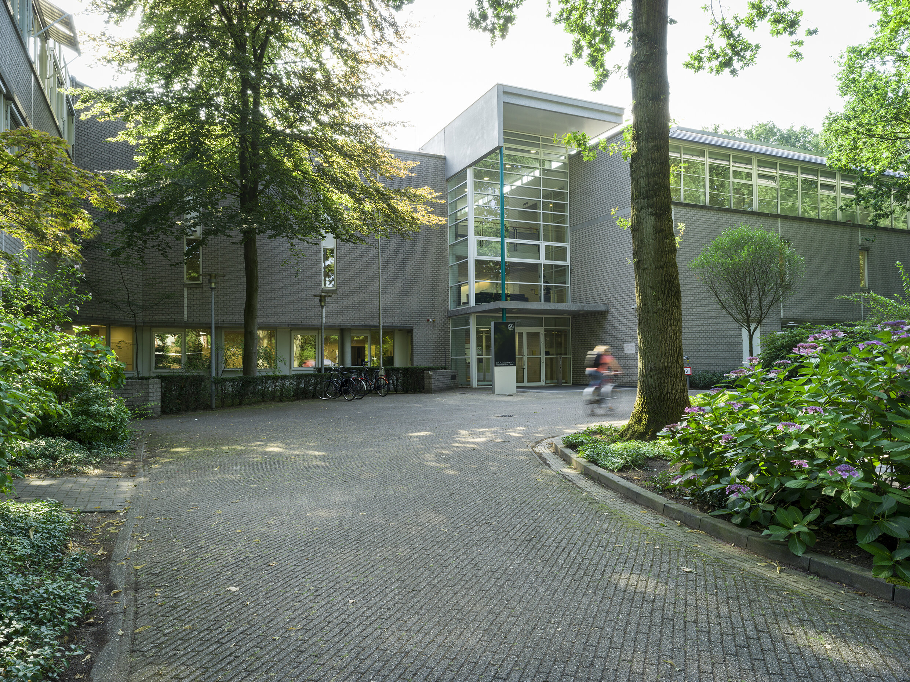
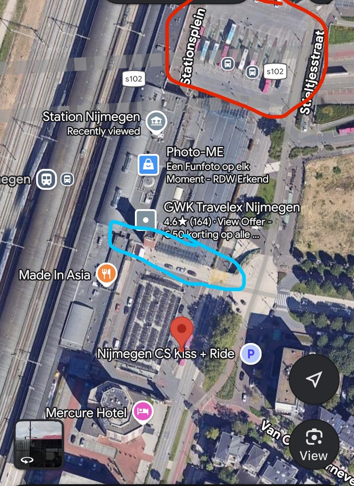

## WiFi
Network: "MPI Workshop"
Password:   ws2223jun

## Getting to the venue

Buses 10, 6,15, 14 and 300 go from Nijmegen station to the MPI. Check [9292](https://9292.nl/) or a navigation app for times.

Please see the map below for locations of the bus stops and the taxi rank near the station. Bus 10 leaves from the red pin, all other buses leave from the bus ranks in the red square. The taxi rank is marked with the turqoise square.

For buses from the city, please refer to 9292 or your navigation app.

The stops closest to the MPI is Spinozagebouw (10, 14, 300) or Van Peltlaan (6, 15). 

You can pay with contactless on all buses, remember to check out when you exit the bus.

Note that bus 58/SB58 is run by a German company and you may have issues paying for the ticket. 

